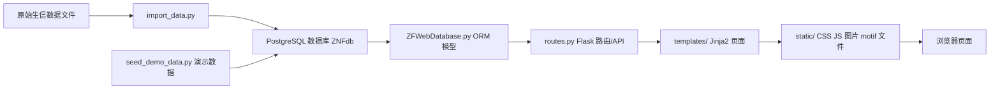
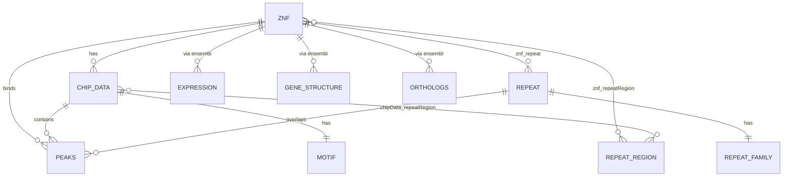

# KRAB DB 项目说明与运行指南

> 项目路径：`/Users/chengyuhang2/Desktop/databaselearn-main/krab_DB-master复现`  
> 阅读对象：第一次接触该项目、需要复现运行和理解代码结构的同学。

## 1. 项目整体定位

这个项目是一个基于 Flask、SQLAlchemy 和 PostgreSQL 的 KRAB-ZNF / Repeat 数据库 Web 应用。它的核心目标是把生信分析得到的 ZNF 转录因子、ChIP-seq peak、重复序列 Repeat、motif、表达量、基因结构和同源基因等信息导入数据库，然后通过网页进行检索和展示。

从页面功能看，它主要提供：

- ZNF/KZFP 检索：按 ZNF gene symbol 查询对应的 ChIP 数据、peak 数、repeat 数、motif、表达量、基因结构和 orthologs。
- Repeat 检索：按 repeat 名称查询 repeat 家族、关联的 ZNF 和 repeat region。
- 列表浏览：通过 Bootstrap Table 展示 ZNF 数据集列表和 Repeat 列表。
- 图表展示：通过 Highcharts 展示 repeat 分布、表达量等统计图。
- 演示数据复现：在没有老师原始生信数据集时，可以用 `seed_demo_data.py` 生成一组最小闭环数据，把页面跑通。

项目的数据流可以理解为：



## 2. 技术栈

| 类型 | 技术 |
| --- | --- |
| 后端框架 | Flask |
| 表单 | Flask-WTF、WTForms |
| ORM | SQLAlchemy |
| 数据库 | PostgreSQL |
| 数据处理 | pandas、numpy |
| 前端样式 | Bootstrap 3 |
| 表格组件 | bootstrap-table |
| 图表组件 | Highcharts / Highstock |
| 静态资源 | 本地 JS/CSS、motif 图片、summary 数据 |

`requirements.txt` 中固定的是兼容旧代码的一组依赖范围：

```text
Flask>=2.2,<3
Flask-WTF>=1.1,<2
WTForms>=3,<4
SQLAlchemy>=1.4,<2
pandas>=1.5,<3
numpy>=1.23,<2
psycopg2-binary>=2.9,<3
```

## 3. 顶层目录结构

```text
krab_DB-master复现/
  README.md                 项目复现简要说明
  MODULES.md                代码模块说明
  app.py                    Flask 应用入口
  routes.py                 页面路由、查询逻辑、JSON API
  ZFWebDatabase.py          SQLAlchemy ORM 表结构和数据库连接封装
  import_data.py            老师原始完整数据导入脚本
  seed_demo_data.py         无真实数据时使用的演示数据脚本
  requirements.txt          Python 依赖清单
  templates/                Jinja2 HTML 页面模板
  static/                   前端静态资源、summary 文件、演示 motif 文件
  database/                 旧版/备份数据库模型和导入脚本
  __pycache__/              Python 字节码缓存，可忽略
```

## 4. 根目录文件说明

### 4.1 `README.md`

项目复现说明文档。它已经说明了项目背景、数据库账号、建表、演示数据导入、真实数据导入和启动网站的大致步骤。

需要注意的是，README 里部分命令使用的是 Windows PowerShell 风格路径。你当前机器是 macOS/Linux 风格路径，实际运行时应使用本文第 10 节中的命令。

### 4.2 `MODULES.md`

模块级说明文档，按文件解释了 `app.py`、`ZFWebDatabase.py`、`routes.py`、`import_data.py`、`seed_demo_data.py`、`templates/`、`static/`、`database/` 的作用。

它适合作为快速索引。不过根据源码核对，根目录 `ZFWebDatabase.py` 中 `C2H2` 类目前被三引号注释掉了，不会真正建表；`getC2H2()` 是残留方法，正常运行流程没有使用它。

### 4.3 `requirements.txt`

Python 依赖文件。运行项目前应先创建虚拟环境，然后执行：

```bash
python -m pip install -r requirements.txt
```

### 4.4 `app.py`

Flask 应用入口文件，内容很短：

- 创建 `Flask` 实例：`app = Flask(__name__)`
- 设置 `SECRET_KEY`
- 导入 `routes.py`，使路由注册到 Flask app 上

`routes.py` 里写的是 `from app import app`，所以 `app.py` 是项目启动的核心入口。

启动项目时应使用：

```bash
flask --app app run --host 127.0.0.1 --port 5000
```

或者：

```bash
python -m flask --app app run --host 127.0.0.1 --port 5000
```

### 4.5 `ZFWebDatabase.py`

这是项目最重要的数据库模型文件，使用 SQLAlchemy ORM 定义数据库表、字段、关系，以及数据库连接封装。

主要内容：

- `Base = declarative_base()`：SQLAlchemy ORM 基类。
- 多个 ORM 表模型：`Znf`、`Chip_data`、`Repeat`、`Repeat_family`、`Peaks`、`Repeat_region`、`Motif`、`Expression`、`Gene_structure`、`Cell_line`、`Orthologs`。
- 多对多关系表：`znf_repeat`、`chip_data_repeat`、`znf_repeatRegion`、`chipData_repeatRegion`。
- `AccurityWebDB` 类：封装连接数据库、建表、创建 session、删表，以及查重式创建对象的方法。

常用方法：

| 方法 | 作用 |
| --- | --- |
| `Connect()` | 根据用户名、密码、主机、数据库名创建 SQLAlchemy engine |
| `CreateAllTable()` | 调用 `Base.metadata.create_all()` 建表 |
| `SessionUp()` | 创建并返回数据库 session |
| `SessionDown()` | 关闭 session |
| `dropAll()` | 删除所有 ORM 中声明的表，危险操作 |
| `getZnf()` | 按 Ensembl 查找已有 ZNF，不存在则返回新对象 |
| `getChip_data()` | 按 data_name 查找已有 ChIP 数据，不存在则返回新对象 |
| `getRepeat()` | 按 repeat_name 查找已有 Repeat，不存在则返回新对象 |
| `getPeaks()` | 按坐标和 enrichment 查找 peak，不存在则返回新对象 |
| `getRepeat_family()` | 查找或创建 repeat family 对象 |
| `getRepeat_region()` | 查找或创建 repeat region 对象 |

直接运行该文件时：

```bash
python ZFWebDatabase.py
```

会连接本地 PostgreSQL：

```text
user: cyh666
password: 666666
database: ZNFdb
host: localhost
port: 5432
```

然后创建所有 ORM 表。

### 4.6 `routes.py`

Flask 路由和接口层。它负责：

- 连接 PostgreSQL。
- 创建全局 session。
- 定义页面路由。
- 处理 ZNF 和 Repeat 搜索表单。
- 从数据库查询数据，组装成模板需要的字典。
- 给 bootstrap-table 返回 JSON。

文件开头会执行：

```python
db = DB.AccurityWebDB("cyh666", "666666", "ZNFdb", hostname="localhost")
db.Connect()
session = db.SessionUp()
```

所以只要启动 Flask，就要求本机 PostgreSQL 已经存在 `ZNFdb`，且账号密码可连接。

主要页面路由：

| 路由 | 函数 | 作用 |
| --- | --- | --- |
| `/` | `index()` | 首页 |
| `/index/` | `index()` | 首页别名 |
| `/Help/` | `help()` | 帮助页面 |
| `/About/` | `about()` | 关于页面 |
| `/Expression/` | `expression()` | 表达相关静态说明页 |
| `/Download/` | `download()` | 下载页，但模板缺失 |
| `/KZFP/` | `kzfp()` | ZNF/KZFP 搜索与列表页 |
| `/Repeat/` | `repeat_page()` | Repeat 搜索与列表页 |
| `/KZFP/zinc_fingure/<data_name>` | `kzfp_one()` | 单个 ChIP 数据对应的 ZNF 详情页 |
| `/Repeat/repeat_one/<repeat_id>` | `repeat_one()` | 单个 Repeat 详情页 |

主要表单路由：

| 路由 | 方法 | 作用 |
| --- | --- | --- |
| `/searchZnf` | GET/POST | 接收 ZNF gene symbol，查 `Znf.gene_symbol`，找到后进入第一个 ChIP 数据详情 |
| `/searchRepeat` | GET/POST | 接收 repeat 名称，查 `Repeat.repeat_name`，找到后进入 repeat 详情 |

主要 JSON API：

| 路由 | 作用 |
| --- | --- |
| `/repeatDataJson/` | 返回 Repeat 列表，供 `Repeat.html` 的 bootstrap-table 使用 |
| `/oneRepeatDataJson/<repeat_id>` | 返回某个 Repeat 关联的 repeat region / ZNF 数据 |
| `/kzpfdatajson/` | 返回 ChIP/ZNF 数据集列表，供 `KZFP.html` 使用 |
| `/znf_summary_json` | 返回 ZNF summary JSON，但当前实现只会返回循环中的最后一组结果，逻辑不完整 |
| `/searchorthologs` | 按 Ensembl ID 查询 orthologs，供 ZNF 详情页表格使用 |

需要特别注意：

- `routes.py` 中有 `sys.path.insert(0, "/home/luozhihui/PycharmProjects/ZNFdatabase")`，这是老师机器上的路径。通常因为该路径在本机不存在，不会影响本地导入；但更干净的做法是删除或改成本项目路径。
- `kzfp_one()` 里读取 motif score 的路径写成了 `./app/static/img/...`，而本项目静态目录是 `./static/img/...`。这会导致 score 读取不到，但页面仍可能用空值继续渲染。
- `Download.html` 不存在，访问 `/Download/` 会报模板找不到。
- `base.html` 引用了 `/static/bootstrap-table-export.min.js`，但当前 `static/` 中没有这个文件。

### 4.7 `import_data.py`

这是老师原始完整数据导入脚本，目标是读取真实生信数据并写入 PostgreSQL。

它依赖大量硬编码路径，例如：

```text
/home/luozhihui/PycharmProjects/ZNFdatabase/data/GSE78099_diff/diff
/home/luozhihui/PycharmProjects/ZNFdatabase/data/GSE78099_out
/home/luozhihui/Project/ZF_database/data_process/C2H2_list/
/home/luozhihui/Project/ZF_database/data_process/expression/cell_line
/home/luozhihui/Project/ZF_database/data_process/gene_structure/
/home/luozhihui/Project/ZF_database/data_process/orthologs/
```

所以如果没有这些原始数据，不能直接完整运行 `import_data.py`。

主要方法：

| 方法 | 作用 |
| --- | --- |
| `parse_GSE78099()` | 读取 peak 与 repeat overlap 表，设置列名 |
| `parseUniprot()` | 读取 UniProt C2H2 注释，统计 zinc finger 信息 |
| `C2H2_information()` | 整合 UniProt、Ensembl mapping、人/鼠 TF 列表，构造 ZNF 基础信息 |
| `import_basic_information()` | 导入 `znf` 表 |
| `import_repeat()` | 导入 `repeat`、`chip_data` 以及 ZNF-Repeat 关系 |
| `import_peaks()` | 导入 peak、repeat region、repeat family、ChIP 关系 |
| `import_expression()` | 导入表达矩阵和 cell line |
| `import_gene_structure()` | 导入转录本和 exon 结构 |
| `import_orthologs()` | 导入同源基因信息 |

文件底部的真实执行顺序是：

```python
db.dropAll()
db.CreateAllTable()

importData = import_data()
session = db.SessionUp()

importData.C2H2_information()
importData.import_basic_information()
importData.import_repeat()
importData.import_peaks()
importData.import_expression()
importData.import_gene_structure()
importData.import_orthologs()
```

其中 `db.dropAll()` 会删除已有表，重新导入前一定要确认数据库可以被清空。

### 4.8 `seed_demo_data.py`

这是整理版新增的演示数据脚本，用来在没有真实原始数据时跑通网站。

它会：

- 连接 `ZNFdb`。
- 自动建表。
- 在 `static/img/GSEDEMO_out/GSMDEMO001_ZNFDEMO1/` 下生成 motif 占位文件。
- 插入一个演示 ZNF：`ZNFDEMO1`。
- 插入一个演示 Repeat：`DEMO_REPEAT_A`。
- 插入一个演示 ChIP 数据集：`GSMDEMO001`。
- 插入 3 条 peak 和 repeat region。
- 插入 expression、cell line、gene structure、orthologs 等详情页需要的数据。

运行：

```bash
python seed_demo_data.py
```

如果演示数据已存在，脚本会跳过。强制删除并重建演示数据：

```bash
python seed_demo_data.py --refresh-demo
```

导入成功后可以测试：

```text
ZNF 搜索词：ZNFDEMO1
Repeat 搜索词：DEMO_REPEAT_A
ZNF 详情页：/KZFP/zinc_fingure/GSMDEMO001
```

### 4.9 `__pycache__/`

Python 自动生成的字节码缓存目录。对理解和运行项目没有帮助，可以忽略；不建议把它当作源码阅读。

## 5. 数据库模型说明

根目录 `ZFWebDatabase.py` 是本项目应以它为准的模型文件。

### 5.1 主要表

| ORM 类 | 表名 | 作用 |
| --- | --- | --- |
| `Znf` | `znf` | ZNF 基因基础信息，包含 Ensembl、Entrez、gene symbol、species、family、protein、synonym、UniProt feature 等 |
| `Chip_data` | `chip_data` | ChIP-seq 数据集信息，包含 GSM 数据编号、数据来源、peak 数、repeat 数，并关联一个 ZNF |
| `Repeat` | `repeat` | 重复序列基础信息，包含 repeat 名称、sub family、main family、关联 ZNF 数 |
| `Repeat_family` | `repeat_family` | Repeat 家族分类扩展信息，与 `Repeat` 一对一 |
| `Peaks` | `peaks` | ChIP peak 区域，包含 chr、start、end、strand、enrichment，并关联 ZNF、Repeat、Chip_data |
| `Repeat_region` | `repeat_region` | Repeat 在基因组上的坐标区域，包含 chr、start、end、strand |
| `Motif` | `motif` | motif 图片和 matrix 文件路径，与 `Chip_data` 一对一 |
| `Expression` | `expression` | 某个 Ensembl gene 在某个 project 下的表达量 JSON 字符串 |
| `Gene_structure` | `gene_structure` | 某个 Ensembl gene 的 transcript 和 exon 结构 JSON |
| `Cell_line` | `cell_line` | 表达项目对应的 cell line 列表 |
| `Orthologs` | `orthologs` | 同源基因信息，供详情页 orthologs 表格展示 |

### 5.2 关系表

| 表名 | 关系 |
| --- | --- |
| `znf_repeat` | `Znf` 与 `Repeat` 多对多 |
| `chip_data_repeat` | `Chip_data` 与 `Repeat` 多对多 |
| `znf_repeatRegion` | `Znf` 与 `Repeat_region` 多对多 |
| `chipData_repeatRegion` | `Chip_data` 与 `Repeat_region` 多对多 |

### 5.3 模型关系图



## 6. `templates/` 页面模板说明

`templates/` 目录保存 Flask/Jinja2 模板。多数页面继承 `base.html`，然后填充 `` 和 ``。

| 文件 | 作用 |
| --- | --- |
| `base.html` | 全站基础模板，包含 `<head>`、导航栏、footer、Bootstrap、jQuery、bootstrap-table、Highcharts 引用 |
| `index.html` | 当前首页模板，继承 `base.html`，包含一个 Bootstrap 风格的简介/入口页面 |
| `iindex.html` | 旧版或实验用首页/表格页面，没有被当前 `routes.py` 使用 |
| `KZFP.html` | ZNF/KZFP 搜索和列表页面，表单提交到 `/searchZnf`，列表数据来自 `/kzpfdatajson` |
| `KZFP.html.old` | 旧版 KZFP 页面备份，当前路由不使用 |
| `Repeat.html` | Repeat 搜索和列表页面，表单提交到 `/searchRepeat`，列表数据来自 `/repeatDataJson` |
| `oneZnf.html` | 当前实际使用的 ZNF 详情页模板，展示 basic information、motif、repeat 图表、expression、gene structure、orthologs |
| `one_znf.html` | 旧版或备份 ZNF 详情页，和 `oneZnf.html` 基本相同，但 orthologs 查询参数写死为 `ENSG00000175105` |
| `one_repeat.html` | Repeat 详情页，展示 repeat 基础信息、相关 ZNF 表格和 Highcharts 图 |
| `expression.html` | 表达页面，目前更像静态说明页，内容中有一些从其他项目迁移的 drug/disease 文案 |
| `help.html` | 帮助页面，部分内容与 KRAB/ZNF 有关，部分仍残留其他项目说明 |
| `about.html` | 关于页面，残留较多 drug/disease/SCG-Drug 文案，不完全贴合本项目 |
| `No_result.html` | 搜索无结果时展示的页面 |

## 7. `static/` 静态资源说明

| 文件/目录 | 作用 |
| --- | --- |
| `bootstrap.css` | 本地 Bootstrap CSS |
| `bootstrap.css.map` | Bootstrap CSS sourcemap |
| `bootstrap.js` | 本地 Bootstrap JS |
| `jquery-3.4.1.min.js` | 本地 jQuery |
| `bootstrap-table.min.css` | bootstrap-table 样式 |
| `bootstrap-table.min.js` | bootstrap-table 脚本 |
| `bootstrap-table-zh-CN.min.js` | bootstrap-table 中文语言包，当前 `base.html` 中被注释 |
| `logo1.png` | 项目 logo，也被演示 motif 文件复制使用 |
| `znf_summary.table` | ZNF summary 表格文本，包含 gene、GSM 数据、peak 数、repeat 数、motif 路径等 |
| `znf_family.json` | ZNF summary JSON 文件，内容和 `znf_summary.table` 类似 |
| `img/GSEDEMO_out/...` | `seed_demo_data.py` 生成的演示 motif 目录，包含 `raw`、`none`、`part`、`full` 四类 motif 文件 |

演示 motif 目录结构如下：

```text
static/img/GSEDEMO_out/GSMDEMO001_ZNFDEMO1/
  raw/
    logo1.png
    matrix
    score
  none/
    logo1.png
    matrix
    score
  part/
    logo1.png
    matrix
    score
  full/
    logo1.png
    matrix
    score
```

## 8. `database/` 旧版目录说明

`database/` 中有两份旧版/备份代码：

```text
database/
  ZFWebDatabase.py
  import_data.py
  __pycache__/
```

它们和根目录版本明显不同：

- `database/ZFWebDatabase.py` 字段更少，关系设计更早期，例如 `Chip_data` 和 `Peaks` 使用过不同的多对多关系。
- `database/import_data.py` 也更早期，逻辑不如根目录 `import_data.py` 完整。
- 当前复现和运行应以根目录的 `ZFWebDatabase.py`、`import_data.py`、`routes.py` 为准。

## 9. 推荐运行顺序：无真实数据，只跑通演示网站

这是最适合学习和验收页面的方式。

### 第一步：进入项目目录

```bash
cd "/Users/chengyuhang2/Desktop/databaselearn-main/krab_DB-master复现"
```

### 第二步：创建并启用虚拟环境

```bash
python3 -m venv .venv
source .venv/bin/activate
```

### 第三步：安装依赖

```bash
python -m pip install --upgrade pip
python -m pip install -r requirements.txt
```

### 第四步：准备 PostgreSQL 数据库

先确保本机 PostgreSQL 正在运行，然后进入 `psql`。

```bash
psql -U postgres
```

在 PostgreSQL 中执行：

```sql
CREATE USER cyh666 WITH PASSWORD '666666';
CREATE DATABASE "ZNFdb" OWNER cyh666;
GRANT ALL PRIVILEGES ON DATABASE "ZNFdb" TO cyh666;
\c ZNFdb
GRANT ALL ON SCHEMA public TO cyh666;
```

如果用户或数据库已经存在，创建语句可能报 already exists，这种情况可以忽略或改用已有账号。

### 第五步：建表

```bash
python ZFWebDatabase.py
```

### 第六步：导入演示数据

```bash
python seed_demo_data.py
```

如果想重建演示数据：

```bash
python seed_demo_data.py --refresh-demo
```

### 第七步：启动 Flask 网站

```bash
flask --app app run --host 127.0.0.1 --port 5000
```

如果 `flask` 命令找不到，使用：

```bash
python -m flask --app app run --host 127.0.0.1 --port 5000
```

### 第八步：浏览器访问

```text
http://127.0.0.1:5000/
```

建议测试页面：

| 页面 | 地址 |
| --- | --- |
| 首页 | `http://127.0.0.1:5000/` |
| ZNF 列表 | `http://127.0.0.1:5000/KZFP/` |
| Repeat 列表 | `http://127.0.0.1:5000/Repeat/` |
| ZNF 演示详情 | `http://127.0.0.1:5000/KZFP/zinc_fingure/GSMDEMO001` |

搜索测试：

```text
ZNF 搜索：ZNFDEMO1
Repeat 搜索：DEMO_REPEAT_A
```

## 10. 推荐运行顺序：有老师真实数据，完整复现数据库

如果你拿到了老师的真实原始数据集，完整复现应按下面顺序进行。

### 第一步：环境和数据库准备

同第 9 节：

1. 进入项目目录。
2. 创建虚拟环境。
3. 安装依赖。
4. 创建 PostgreSQL 用户和 `ZNFdb` 数据库。

### 第二步：修改真实数据路径

打开 `import_data.py`，把所有 `/home/luozhihui/...` 改成你本机真实数据所在路径。

至少需要修改这些数据来源：

| 数据 | 代码中的变量/路径 |
| --- | --- |
| GSE78099 peak-repeat overlap 文件目录 | `self.ZNF_GSE78099` |
| GSE76496 文件目录 | `self.ZNF_GSE76496`，当前完整流程基本没有使用 |
| motif 输出目录 | `self.GSE78099_img_path` |
| UniProt C2H2 注释 | `parseUniprot()` 中的 `uniprot-c2h2-human.txt` |
| Ensembl mapping | `Homo_sapiens_mapping_list.txt` |
| 人/鼠 TF 列表 | `Homo_sapiens_TF`、`Mus_musculus_TF` |
| expression cell line 文件 | `import_expression()` 中的 `cellLine_base_path` |
| gene structure CSV | `humangene_structures.csv`、`humanTranscript_exon.csv` |
| orthologs CSV | `9606gene_homolog.csv` |

### 第三步：检查 pandas 兼容性

`import_data.py` 中还残留旧 pandas 接口：

```python
df.ix[j]
structures.ix[Transcript]
```

新版 pandas 已经删除 `.ix`。如果运行时报错，需要改成：

- 按标签取行：`.loc[...]`
- 按位置取行：`.iloc[...]`

这里通常应改成 `.loc[...]`，因为代码遍历的是 DataFrame 的 index。

### 第四步：确认是否允许删库重建

`import_data.py` 底部默认会执行：

```python
db.dropAll()
db.CreateAllTable()
```

这会删除当前 ORM 管理的全部表，然后重建。如果数据库里有你要保留的数据，先备份或注释掉 `dropAll()`。

### 第五步：运行完整导入

```bash
python import_data.py
```

完整导入顺序是：

1. `C2H2_information()`：读取 C2H2/UniProt/Ensembl 基础信息。
2. `import_basic_information()`：导入 ZNF 基础表。
3. `import_repeat()`：导入 Repeat、ChIP 数据和 ZNF-Repeat 关系。
4. `import_peaks()`：导入 peak、repeat region、repeat family 等核心数据。
5. `import_expression()`：导入表达矩阵和 cell line。
6. `import_gene_structure()`：导入 transcript/exon 结构。
7. `import_orthologs()`：导入 orthologs。

### 第六步：启动网站

```bash
flask --app app run --host 127.0.0.1 --port 5000
```

访问：

```text
http://127.0.0.1:5000/
```

## 11. 页面和接口的使用逻辑

### 11.1 ZNF 页面

访问：

```text
/KZFP/
```

前端页面：

- 模板：`templates/KZFP.html`
- 表单提交：`/searchZnf`
- 列表数据：`/kzpfdatajson`

点击列表或搜索成功后进入：

```text
/KZFP/zinc_fingure/<data_name>
```

详情页会查询：

- `Chip_data.data_name`
- 关联的 `Znf`
- 该 ChIP 数据下的 `Peaks`
- ZNF 关联的 `Repeat`
- `Expression`
- `Cell_line`
- `Gene_structure`
- `Orthologs`

### 11.2 Repeat 页面

访问：

```text
/Repeat/
```

前端页面：

- 模板：`templates/Repeat.html`
- 表单提交：`/searchRepeat`
- 列表数据：`/repeatDataJson`

搜索成功后进入：

```text
/Repeat/repeat_one/<repeat_id>
```

详情页会查询：

- `Repeat`
- `Repeat_family`
- 关联的 `Znf`
- 关联的 `Repeat_region`

### 11.3 Orthologs 表格

ZNF 详情页中的 orthologs 表格使用：

```text
/searchorthologs?ensembl=<当前 ZNF 的 Ensembl ID>
```

当前实际使用的模板是 `oneZnf.html`，它会动态传入当前 ZNF 的 `ensembl`。旧文件 `one_znf.html` 中该参数写死，不建议使用。

## 12. 常见问题和坑点

### 12.1 启动时报数据库连接错误

原因通常是：

- PostgreSQL 没启动。
- 没有创建 `ZNFdb`。
- 没有创建用户 `cyh666`。
- 密码不是 `666666`。
- PostgreSQL 端口不是 `5432`。

对应检查：

```bash
psql -h localhost -p 5432 -U cyh666 -d ZNFdb
```

### 12.2 启动时报 `TemplateNotFound: Download.html`

这是因为 `/Download/` 路由返回：

```python
return render_template("Download.html")
```

但 `templates/` 中没有 `Download.html`。不要访问该路由，或补一个模板。

### 12.3 表格导出 JS 404

`base.html` 引用了：

```html
<script src="/static/bootstrap-table-export.min.js"></script>
```

但当前 `static/` 没有该文件。普通列表浏览不一定受影响，但浏览器控制台会出现 404。需要导出功能时，应补齐该 JS 或删除引用。

### 12.4 详情页 motif score 读不到

`routes.py` 中 score 文件路径使用：

```python
./app/static/img/...
```

但项目真实目录是：

```text
./static/img/...
```

所以 score 可能读不到，页面会使用空值继续渲染。后续修复时应把 `./app/static/img` 改为项目根目录下的 `static/img`。

### 12.5 `import_data.py` 不能直接运行

原因是它依赖老师机器上的真实数据路径。必须先把硬编码路径替换成本机路径，并确认数据文件格式一致。

### 12.6 pandas `.ix` 报错

新版 pandas 删除了 `.ix`，需要替换为 `.loc` 或 `.iloc`。该问题主要影响完整真实数据导入，不影响 `seed_demo_data.py`。

### 12.7 `/znf_summary_json` 逻辑不完整

该接口循环查询所有 ZNF，但构造 JSON 的代码在循环外，最终只会使用最后一次循环的变量，还返回重复的两条相同记录。当前页面主要用 `/kzpfdatajson/`，所以该问题未必影响主流程。

### 12.8 `about.html`、`expression.html` 有旧项目文案

这些模板里有 drug、disease、SCG-Drug 等残留内容，应该是从其他项目迁移后未完全改写。展示项目时建议优先介绍 `/KZFP/` 和 `/Repeat/` 两个核心页面。

## 13. 最小复现命令清单

如果你只想按顺序复制运行，使用下面这组命令。

```bash
cd "/Users/chengyuhang2/Desktop/databaselearn-main/krab_DB-master复现"

python3 -m venv .venv
source .venv/bin/activate

python -m pip install --upgrade pip
python -m pip install -r requirements.txt

python ZFWebDatabase.py
python seed_demo_data.py

flask --app app run --host 127.0.0.1 --port 5000
```

数据库需要提前用 PostgreSQL 创建：

```sql
CREATE USER cyh666 WITH PASSWORD '666666';
CREATE DATABASE "ZNFdb" OWNER cyh666;
GRANT ALL PRIVILEGES ON DATABASE "ZNFdb" TO cyh666;
\c ZNFdb
GRANT ALL ON SCHEMA public TO cyh666;
```

启动后访问：

```text
http://127.0.0.1:5000/
```

测试关键词：

```text
ZNFDEMO1
DEMO_REPEAT_A
```

## 14. 建议的学习阅读顺序

如果是为了理解代码，建议按这个顺序阅读：

1. `README.md`：先了解复现背景和基本运行步骤。
2. `requirements.txt`：确认依赖和技术栈。
3. `app.py`：理解 Flask 入口如何加载路由。
4. `ZFWebDatabase.py`：理解数据库表、字段和关系。
5. `seed_demo_data.py`：理解最小数据如何满足页面展示。
6. `routes.py`：理解页面请求如何查询数据库并返回模板或 JSON。
7. `templates/base.html`：理解公共布局和前端依赖。
8. `templates/KZFP.html`、`templates/Repeat.html`：理解列表页和表单。
9. `templates/oneZnf.html`、`templates/one_repeat.html`：理解详情页展示。
10. `import_data.py`：最后看完整真实数据导入，因为它依赖外部数据最多，复杂度最高。
11. `database/`：只作为旧版参考，不作为当前运行主线。

## 15. 一句话总结

这个项目的主线是：`ZFWebDatabase.py` 定义 PostgreSQL 表结构，`import_data.py` 或 `seed_demo_data.py` 把数据写入数据库，`routes.py` 负责查询和接口，`templates/` 与 `static/` 负责网页展示。实际复现时，最稳妥的顺序是先建虚拟环境和 PostgreSQL，再运行 `ZFWebDatabase.py` 建表，然后用 `seed_demo_data.py` 导入演示数据，最后用 `flask --app app run` 启动网站。
